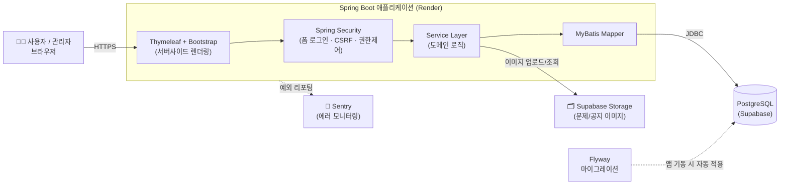
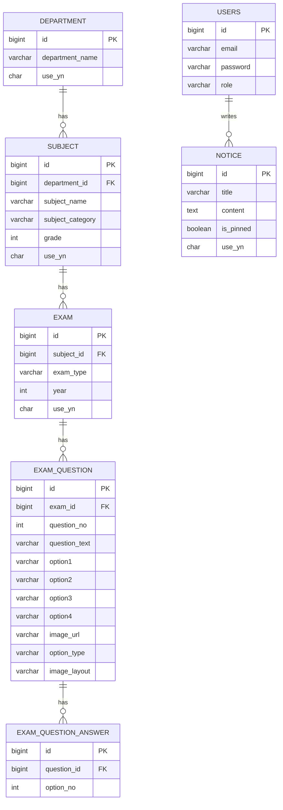
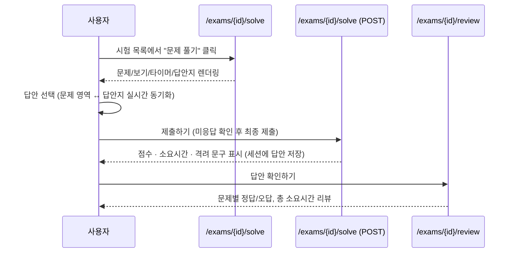

# 📘 KNOU CBT (Computer Based Test)

----

## 📌 소개
- KNOU CBT는 한국방송통신대학교 학생들을 위한 **비공식 전자 기출문제집 서비스**입니다.
- 관리자는 학과/과목/시험/문제/공지사항을 등록·수정·삭제할 수 있고, 사용자는 실제 시험처럼 문제를 풀고 결과와 답안을 확인할 수 있습니다.
- 현재 [Render](https://render.com) + [Supabase](https://supabase.com) 기반으로 배포되어 있는 Beta 서비스입니다.

----

## 🎯 목적
- 종이 기반 기출문제 학습의 불편함 개선
- 웹 기반 CBT(Computer Based Test) 제공으로 접근성과 학습 효율 향상
- 관리자와 사용자 모두에게 직관적인 UI/UX 제공

----

## 🛠 사용 기술

| 구분 | 기술 |
|---|---|
| Backend | Spring Boot 3.2.6, Spring Security 6, MyBatis |
| Frontend | Thymeleaf (+ Layout Dialect), Bootstrap 5.3.3, Vanilla JS |
| Database | PostgreSQL, Flyway (스키마 마이그레이션) |
| Storage | Supabase Storage (문제/공지 첨부 이미지) |
| 파일 처리 | Apache POI (엑셀 문제 일괄 업로드), Jsoup (공지 본문 XSS Sanitize) |
| 모니터링 | Sentry |
| 배포 | Docker, Render |
| Build/Etc | Gradle, Git |

----

## 🏗 아키텍처

----

## ✨ 주요 기능

### 👩‍💻 사용자(User) 기능
- 학과 → 과목 → 구분(출석대체/기말/계절학기) → 년도 순 계층 검색으로 기출문제 빠르게 탐색
- 홈 화면에서 학과별 기출문제 바로가기, 최근 공지 미리보기 확인
- 시험 문제 풀이 (남은시간 타이머 · 진행률 · 답안지 실시간 반영)
- 문제 보기는 텍스트 또는 **이미지**(2단/1단 레이아웃) 어느 쪽이든 지원, 문제 자체에 이미지 첨부도 가능
- 정답은 단일/복수 선택 모두 지원 (예: `2` 또는 `2,3` 중 하나만 맞아도 정답 처리)
- 시험 결과(점수 원형 그래프, 소요시간)와 문제별 정답/오답 리뷰 확인
- 공지사항 열람 (고정 공지 상단 노출)

### 🛠 관리자(Admin) 기능
- 학과/과목/시험 CRUD — 연결된 하위 데이터(과목→학과, 시험→과목, 문제→시험)가 있으면 삭제 방지
- 문제 등록/수정 — 직접 입력 또는 엑셀 일괄 업로드, 보기 이미지 업로드, 문제별 미리보기(정답 표시)
- 공지사항 CRUD (Toast UI Editor 기반, XSS 방지를 위한 서버측 Sanitize 적용)
- 학과/과목/시험 목록 계층형 드롭다운 검색 + 페이지네이션

### 🌐 공통
- Spring Security 기반 로그인/권한 관리 (자동 로그인 14일 유지)
- CSP(Content Security Policy) 적용, 이미지 업로드 MIME/확장자 검증
- Thymeleaf Layout 적용으로 전 화면 일관된 헤더/푸터 구조
- 전역 예외 처리 (404/403/409/500 등 상황별 응답 분리)
- Sentry 연동으로 운영 중 예외 실시간 모니터링

----

## 🗂 도메인 구조 (ERD)

----

## 🔄 시험 응시 플로우

----

## 📸 화면 예시

### 👩‍💻 사용자(User) 화면
1. . **메인 화면**  
   
---
2. **시험 목록**  
   
---
3. **시험 응시 화면 (문제/타이머/프로그레스바)**  
   
---
4. **시험 결과 및 리뷰 화면**  
   
   

---

### 🛠 관리자(Admin) 화면
1. **시험/문제 관리**  
   
   
   
----
2. **과목/학과 관리**  
   
   
----
3. **공지사항 관리 (웹에디터 적용)**  
   

----

## 📕 개발 일지
- [[개발일지#000] 방통대CBT 제작계기 & 사용기술스택 & 요구사항](https://ddururiiiiiii.tistory.com/463)
- [[개발일지#001] 데이터베이스 설계 및 생성](https://ddururiiiiiii.tistory.com/464)
- [[개발일지#002] 스프링 프로젝트 생성 및 Mybatis 연결](https://ddururiiiiiii.tistory.com/465)
- [[개발일지#003] 기본 부트스트랩 적용 / 기출문제 전체조회 구현](https://ddururiiiiiii.tistory.com/467)
- [[개발일지#004] 기출문제 목록조회 (검색조회 및 페이지네이션 포함)](https://ddururiiiiiii.tistory.com/472)
- [[개발일지#005] 시험풀기 화면 구현 (레이아웃, 안푼문제, 소요시간 등)](https://ddururiiiiiii.tistory.com/473)
----
- [[개발일지#006] 학과(Department) 도메인 리빌딩 (리팩토링X)](https://ddururiiiiiii.tistory.com/699)
- [[개발일지#007] 과목(Subject) 도메인 리빌딩 (리팩토링X)](https://ddururiiiiiii.tistory.com/701)
- [[개발일지#008] 시험(Exam) 도메인 리빌딩 (리팩토링X)](https://ddururiiiiiii.tistory.com/702)
- [[개발일지#009] 시험문제/정답(ExamQuestion, ExamQuestionAnswer) 도메인 리빌딩 (리팩토링X)](https://ddururiiiiiii.tistory.com/705)
- [[개발일지#010] 공지(Notice) 도메인 CRUD + 화면](https://ddururiiiiiii.tistory.com/706)
- [[개발일지#011] 운영/배포에 대비한 Spring Boot 프로젝트 준비 (1)](https://ddururiiiiiii.tistory.com/707)
- [[개발일지#012] 운영/배포를 위한 인프라 설계](https://ddururiiiiiii.tistory.com/708)
- [[개발일지#013] Supabase PostgreSQL 데이터베이스 연결하기 (가입부터 생성, 연결까지)](https://ddururiiiiiii.tistory.com/709)
- [[개발일지#014] Render + Docker 배포 하기 (가입부터 배포까지)](https://ddururiiiiiii.tistory.com/710)
- [[개발일지#015] 이미지 첨부 스토리지 연결하기](https://ddururiiiiiii.tistory.com/711)
- [[개발일지#016] 데이터베이스 마이그레이션 하기](https://ddururiiiiiii.tistory.com/712)
