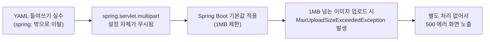

# YAML 설정 트러블슈팅 노트 — `spring.servlet.multipart` 들여쓰기 오류 (내부용)

## 개요
- 문제 등록 화면에서 이미지 첨부하면 500 에러 발생
- 원인은 코드 로직이 아니라 **YAML 들여쓰기 실수 하나**였음
- 커밋 `87e6376`(설정 분리)에서 문제 생김 → 커밋 `55d6ec6`에서 수정됨

---

## 1. 무슨 일이 있었나

`application.yml`을 개발/운영 환경별로 분리하는 작업을 하면서, `spring:` 밑에 있어야 할 설정 몇 개가 실수로 **최상위(top-level)**로 빠져나감.

```yaml
# 잘못된 상태 (spring 밖으로 빠짐)
spring:
  application:
    name: knou-cbt

mybatis:              # ❌ spring 하위 아님
  ...

servlet:               # ❌ spring 하위 아님, 그냥 무의미한 키
  multipart:
    max-file-size: 20MB
    max-request-size: 20MB
```

`mybatis`는 원래부터 최상위 키라 상관없지만, **`servlet.multipart`는 원래 `spring.servlet.multipart`로 써야만 Spring Boot가 인식하는 설정**임. `spring:` 밖에 있으면 Spring Boot 입장에서는 그냥 "이름 모를 설정값"이라 조용히 무시함. 에러도 안 뜸.

---

## 2. 왜 하필 이미지 업로드에서만 터졌나

| 항목 | 설정한 값 | 실제 적용된 값 |
|---|---|---|
| `max-file-size` | 20MB (의도) | **1MB (Spring Boot 기본값)** |
| `max-request-size` | 20MB (의도) | **10MB (Spring Boot 기본값)** |

설정이 무시되면서 Spring Boot의 기본 업로드 제한(1MB)이 그대로 적용됨. 그래서:



작은 이미지는 안 걸리고, 좀 큰 이미지만 500 에러가 나서 처음엔 "왜 어떤 이미지는 되고 어떤 건 안 되지?"로 헷갈렸음. 원인이 용량 제한인 걸 알기까지 시간이 걸림.

---

## 3. 어떻게 고쳤나 (`55d6ec6`)

**① YAML 들여쓰기 수정** — `servlet`, `flyway` 등을 전부 `spring:` 하위로 이동

```yaml
# 수정 후
spring:
  servlet:
    multipart:
      max-file-size: 20MB
      max-request-size: 20MB
  flyway:
    enabled: true
    ...

mybatis:      # 이건 원래 최상위가 맞음
  ...
```

**② 용량 초과 시 500 대신 친절한 안내 메시지 추가** — 설정을 고쳐도 "그럼 20MB 넘는 파일 올리면?"이라는 상황은 여전히 남기 때문에, 아예 예외 처리를 추가함

```java
// GlobalExceptionHandler.java
@ExceptionHandler(MaxUploadSizeExceededException.class)
public String handleMaxUploadSizeExceeded(...) {
    response.setStatus(HttpStatus.BAD_REQUEST.value());
    model.addAttribute("message", "첨부한 파일 용량이 너무 큽니다. 파일당 20MB 이하로 업로드해주세요.");
    return "error/400";
}
```

---

## 4. 교훈 / 재발 방지

- **YAML은 들여쓰기 오류가 나도 에러를 안 던짐** — 그냥 조용히 무시되고 기본값이 적용됨. 이게 제일 무서운 부분
- 설정 파일을 나눌 때(`application.yml` → 환경별 분리 등)는 **분리 직후 반드시 실제로 해당 기능(여기선 이미지 업로드)을 눌러서 확인**하는 습관 필요
- 비슷한 사고를 막으려면: 배포 전 체크리스트에 "설정 파일 변경 시 관련 기능 스모크 테스트" 항목 추가 고려 (Tier 1 스모크 테스트 체크리스트와 연결)
- 예외 상황(용량 초과 등)은 500(서버 에러)이 아니라 400(잘못된 요청) 등 상황에 맞는 응답으로 처리하는 게 원칙 — 이번에 그 원칙이 자연스럽게 자리잡음
