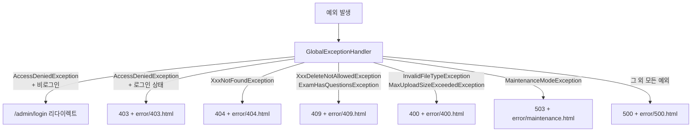

# 예외 처리 컨벤션 / 에러 코드 체계 (내부용)

## 개요
- 모든 예외는 `GlobalExceptionHandler` 한 곳(`@ControllerAdvice`)에서 처리함 — 각 컨트롤러에 개별 try-catch 없음
- 원칙: **예외 종류 → HTTP 상태 코드 → 전용 에러 화면**을 1:1로 매핑
- 이 문서는 지금까지 정해진 컨벤션을 정리해서, 앞으로 새 예외 추가할 때 기준으로 삼기 위함

---

## 1. 전체 흐름



---

## 2. 상태 코드별 컨벤션 표

| 상태 코드 | 언제 쓰나 | 대표 예외 | 로그 레벨 | Sentry 리포팅 |
|---|---|---|---|---|
| 리다이렉트 | 비로그인 사용자가 인증 필요한 곳 접근 | `AccessDeniedException` (비로그인) | 없음 | ❌ |
| 403 | 로그인은 했지만 권한 없음 | `AccessDeniedException` (로그인 상태) | `warn` | ❌ |
| 404 | 존재하지 않는 리소스 조회 | `ExamNotFoundException` 등 `XxxNotFoundException` | `warn` | ❌ |
| 409 | 연관 데이터 있어서 삭제 불가 | `XxxDeleteNotAllowedException`, `ExamHasQuestionsException` | `warn` | ❌ |
| 400 | 잘못된 입력(파일 타입/용량 등) | `InvalidFileTypeException`, `MaxUploadSizeExceededException` | `warn` | ❌ |
| 503 | 점검 모드 중 접근 | `MaintenanceModeException` | 없음 | ❌ |
| 500 | 그 외 예상 못 한 모든 예외 | `Exception` (catch-all) | `error` | ✅ |

> Sentry는 `log.error`로 남긴 것만 잡음 (Tier 1 "모니터링 도구 구성" 문서 참고). 그래서 위 표에서 **500만 Sentry에 리포팅됨** — 나머지는 "정상적으로 처리된 예외 상황"이라는 게 이 구조의 설계 의도임.

---

## 3. 새 예외를 추가할 때 따르는 규칙

1. **도메인별 커스텀 예외를 만든다** — 예: `NoticeNotFoundException`처럼 도메인 패키지 하위 `exception` 패키지에 위치
2. **어느 상태 코드에 속하는지부터 정한다** — 위 표에서 가장 가까운 카테고리 찾기
   - 리소스가 없다 → 404
   - 권한/인증 문제다 → 403 (AccessDeniedException 계열)
   - 연관 데이터 때문에 처리 불가하다 → 409
   - 사용자 입력이 잘못됐다 → 400
   - 그 외 진짜 버그/예상 못 한 상황 → 별도 핸들러 안 만들고 그냥 500으로 흘려보내도 됨 (catch-all이 처리)
3. **기존 `@ExceptionHandler` 배열에 새 예외 클래스를 추가**하거나(같은 카테고리면), 새로운 상황이면 새 핸들러 메서드 추가
4. **로그 레벨 규칙 지키기**: "정상적으로 처리 가능한 예외"는 `warn`, "예상 못 한 예외"만 `error`로 남김 (Sentry가 500만 잡는 구조이기 때문에 이 구분이 중요함)

---

## 4. 특이 케이스 — `AccessDeniedException` 하나가 두 갈래로 갈림

같은 예외 클래스인데, **로그인 여부에 따라 결과가 완전히 달라지는 유일한 케이스**임.

```java
if (!authenticated) {
    return "redirect:/admin/login";   // 비로그인 → 로그인 화면으로
}
// 로그인 상태 → 진짜 권한 문제
response.setStatus(HttpStatus.FORBIDDEN.value());
return "error/403";
```

- 비로그인 사용자가 관리자 페이지 접근 → "너 로그인부터 해" (403 화면 보여줄 필요 없음)
- 로그인은 했는데 권한이 부족한 사용자 → "너는 접근 권한이 없어" (진짜 403)

새로운 인증 관련 예외를 추가할 때도 이 패턴(로그인 여부로 분기)을 참고하면 됨.

---

## 5. 에러 화면 템플릿 위치

`src/main/resources/templates/error/` 하위에 상태 코드별로 정리되어 있음: `400.html`, `403.html`, `404.html`, `409.html`, `500.html`, `maintenance.html`. 새 상태 코드 추가 시 같은 위치에 같은 네이밍 규칙으로 추가하면 됨.
