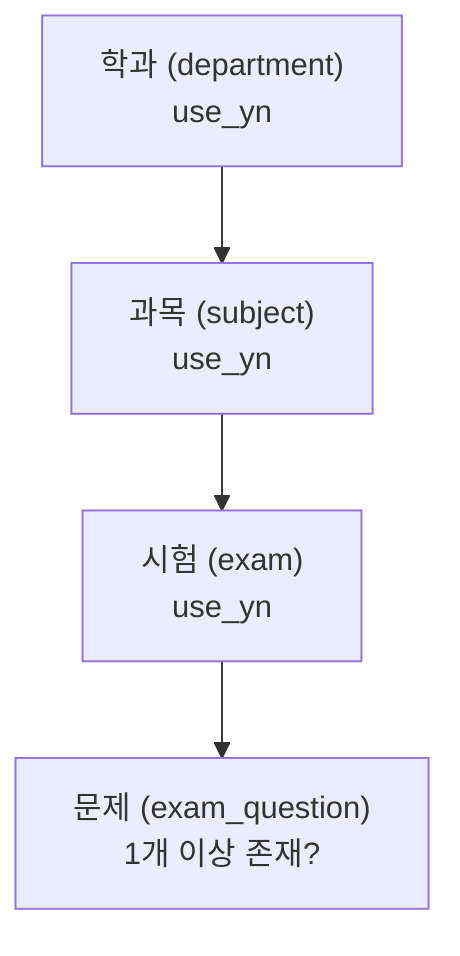

# 계층적 사용여부(use_yn) 로직 설계 노트 (내부용)

## 개요
- 학과 → 과목 → 시험은 3단 계층 구조이고, 각 단계마다 `use_yn`(사용여부) 컬럼이 따로 있음
- 문제: 시험 자체는 `use_yn = 'Y'`인데, 그 시험이 속한 과목이나 학과가 `use_yn = 'N'`이면? → **상위가 꺼져 있으면 하위도 같이 숨겨야 함**
- 이 문서는 그 규칙을 실제로 어떻게 SQL/코드로 구현했는지 정리함

---

## 1. 구조



3단계 + "문제가 실제로 있는가"까지 총 4가지 조건을 **전부 AND로 묶어야만** 사용자에게 시험이 노출됨.

---

## 2. 핵심 결정 — "AND로 묶는다"

과목이나 학과를 `use_yn = 'N'`으로 끄면, 그 밑에 달린 모든 시험이 개별적으로 꺼져있지 않아도 **자동으로 숨겨져야 한다**고 결정함. 안 그러면 관리자가 학과 하나 끌 때마다 그 밑의 과목·시험을 일일이 다 꺼야 하는 번거로움이 생김.

실제 쿼리 (`ExamMapper.xml`):

```sql
<if test="onlyActive">
    AND e.use_yn = 'Y' AND s.use_yn = 'Y' AND d.use_yn = 'Y'
    AND EXISTS (SELECT 1 FROM exam_question eq WHERE eq.exam_id = e.id)
</if>
```

| 조건 | 의미 |
|---|---|
| `e.use_yn = 'Y'` | 시험 자체가 사용 중 |
| `s.use_yn = 'Y'` | 시험이 속한 과목이 사용 중 |
| `d.use_yn = 'Y'` | 과목이 속한 학과가 사용 중 |
| `EXISTS (문제 존재)` | 등록만 해두고 아직 문제를 안 채운 빈 시험이 아님 |

네 조건 중 하나라도 안 맞으면 비회원/일반 사용자 목록에서 빠짐.

---

## 3. 관리자와 일반 사용자를 같은 쿼리로 처리 — `onlyActive` 플래그

새 테이블이나 별도 API를 만들지 않고, **같은 조회 메서드에 `onlyActive` 파라미터 하나만 추가**해서 관리자/일반 사용자를 분기함.

```java
// ExamViewController.java
boolean isAdmin = SecurityUtils.isAdmin();
examService.listPage(..., !isAdmin);   // 관리자면 false → 전부 조회, 아니면 true → 필터 적용
```

- 관리자(`isAdmin = true`) → `onlyActive = false` → 위 AND 조건 자체가 안 붙음 → **꺼진 것까지 전부 조회** (관리 목적)
- 그 외 전부(`isAdmin = false`, 비회원 포함) → `onlyActive = true` → AND 조건 적용

---

## 4. 관리자 화면 UX 보완 — 경고 아이콘

AND 조건으로 숨기기만 하면 관리자 입장에서 "왜 이 시험이 사용자 화면에 안 보이지?"를 알기 어려움. 그래서 조회 결과에 상위 계층의 `use_yn` 값도 같이 내려줌.

```sql
SELECT ..., e.use_yn, s.use_yn AS subject_use_yn, d.use_yn AS department_use_yn, ...
```

관리자 화면에서는 이 값들을 보고 "시험은 켜져 있지만 상위 과목이 꺼져 있어서 실제로는 안 보임" 같은 상황을 경고 아이콘으로 안내함. 즉 **DB 필터링(AND 조건)과 관리자 UX(경고 표시)를 분리**해서, 관리자는 왜 안 보이는지 헷갈리지 않게 함.

---

## 5. 왜 이 방식을 택했나 (대안과 비교)

| 방식 | 장점 | 단점 | 채택 여부 |
|---|---|---|---|
| 하위 항목 끌 때마다 일일이 수동으로 use_yn 끄기 | 쿼리 단순 | 관리자가 실수로 빼먹기 쉬움, 번거로움 | ❌ |
| 상위가 꺼지면 하위 use_yn을 실제로 같이 업데이트(전파) | 조회는 단순 | 이력 관리 꼬임 (나중에 상위만 다시 켜면 하위는 원래 상태를 잃어버림) | ❌ |
| **조회 시점에 3단 AND로 계산 (현재 방식)** | 각 계층의 use_yn 원래 값이 그대로 보존됨, 상위 하나만 바꾸면 전체 반영 | 쿼리가 join을 3단으로 타야 함 | ✅ 채택 |

핵심은 "상위 하나 끄면 하위 값 자체를 건드리지 않고도, 조회 시점에만 안 보이게 만든다"는 것 — 나중에 상위를 다시 켜면 하위 항목들은 각자 원래 상태(use_yn) 그대로 복원됨.
