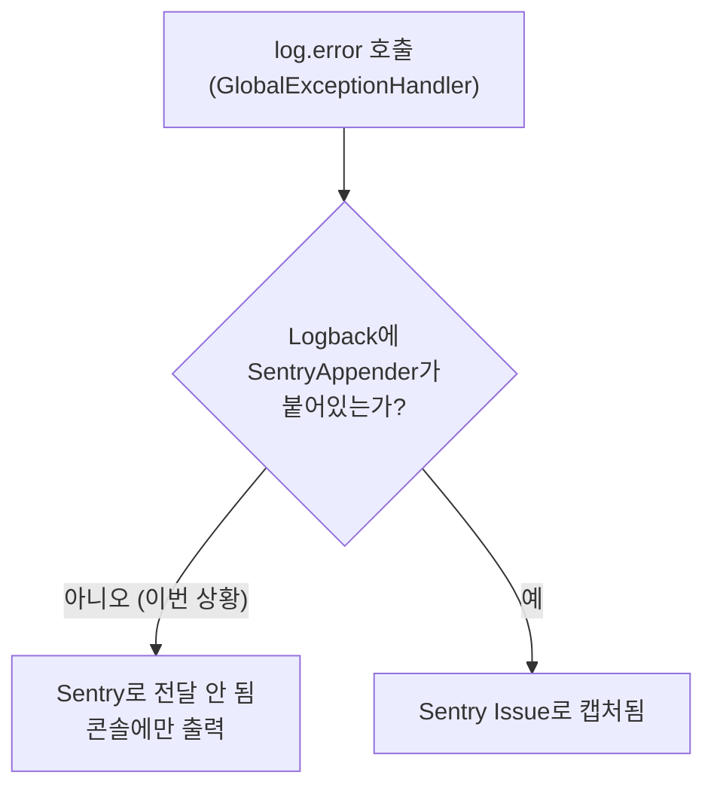

# Sentry 알림이 전혀 안 오던 이유 — `sentry-logback` 누락 트러블슈팅 (내부용)

## 개요
- Sentry에 `sentry:` 설정 블록을 추가하고 관리자 전용 테스트 엔드포인트(`/admin/debug/test-error`)로 강제 예외까지 던져봤는데, Sentry Issues에도 안 잡히고 알림 이메일도 전혀 안 옴
- Sentry SDK 자체는 정상 동작 중이었음(성능추적 트랜잭션은 실제로 전송됨) — 그런데 우리 코드의 `log.error()` 호출만 이벤트로 안 잡힘
- 원인: `sentry-spring-boot-starter-jakarta`가 `sentry-logback`을 자동으로 끌고 오지 않고, 프로젝트가 커스텀 `logback-spring.xml`을 쓰고 있어서 Sentry의 Logback 자동 연동 자체가 걸려있지 않았음
- 커밋 `912e5a8`(설정 추가) → `3155b4f`(디버그 로그로 원인 추적) → `511f0be`(근본 원인 수정) → `7e336fb`(부수 발견 버그 정리)

---

## 1. 무슨 일이 있었나

`application-prod.yml`에 `sentry:` 블록이 통째로 빠져있는 걸 먼저 발견해서 추가함:

```yaml
sentry:
  dsn: ${SENTRY_DSN:}
  environment: prod
  traces-sample-rate: 0.1
```

그리고 실제로 알림이 오는지 검증하려고, ROLE_ADMIN 전용으로 강제 예외를 던지는 엔드포인트를 하나 추가함:

```java
@RestController
@RequestMapping("/admin/debug")
public class AdminDebugController {
    @GetMapping("/test-error")
    public String testError() {
        throw new RuntimeException("Sentry 알림 테스트용 강제 예외");
    }
}
```

배포 후 관리자로 로그인해서 접속하면 500 에러 화면은 정상적으로 뜸(`GlobalExceptionHandler`가 예외를 잡아서 로그도 남김). 그런데 Sentry Issues 목록엔 아무것도 안 뜨고, 알림 이메일도 안 옴.

---

## 2. 원인을 어떻게 좁혀갔나

먼저 `SENTRY_DSN` 환경변수 자체가 비어있는 게 아닌지 의심함 → Render 대시보드에서 값이 채워져 있는 것 확인. DSN 문제는 아님.

다음으로 `sentry.debug: true`를 임시로 켜서 실제 SDK 내부 로그를 확인함:

```yaml
sentry:
  dsn: ${SENTRY_DSN:}
  environment: prod
  traces-sample-rate: 0.1
  debug: true   # 임시
```

Render 로그에서 `DEBUG: Envelope sent successfully.` 같은 줄이 실제로 찍히는 걸 확인함 — 즉 **Sentry SDK는 살아있고 실제로 이벤트를 전송하고 있음**. 다만 그 이벤트는 우리가 던진 예외가 아니라, 봇/헬스체크가 보낸 `HEAD /` 요청의 **성능추적(transaction) 이벤트**였음. 그 이벤트의 메타데이터를 자세히 보니:

```json
"sdk": {
  "integrations": ["SpringBoot3", "UncaughtExceptionHandler", "ShutdownHook"]
}
```

**"Logback" 관련 통합이 목록에 아예 없음.** 이게 결정적 단서였음.

`log.error("Unhandled exception", ex)` 호출이 Sentry로 전달되려면 Logback 연동(SentryAppender)이 붙어있어야 하는데, 그게 없다는 뜻. `GlobalExceptionHandler`가 `@ControllerAdvice`로 예외를 잡아서 500 화면으로 처리하기 때문에, JVM 입장에서는 이 예외가 "처리 안 된 예외(uncaught)"가 아니라 "정상적으로 처리된 요청"이 됨 — 그래서 `UncaughtExceptionHandler` 통합도 이 케이스에선 안 잡음. 즉 로그 기반 캡처 경로가 없으면 이 프로젝트의 예외 처리 구조상 Sentry가 잡을 방법이 없었음.



원인을 확정하려고 실제 의존성 트리를 확인함:

```bash
./gradlew dependencies --configuration runtimeClasspath -q | grep -i sentry
```

```
\--- io.sentry:sentry-spring-boot-starter-jakarta:7.14.0
     +--- io.sentry:sentry-spring-boot-jakarta:7.14.0
     |    +--- io.sentry:sentry:7.14.0
     |    \--- io.sentry:sentry-spring-jakarta:7.14.0
     |         \--- io.sentry:sentry:7.14.0
```

**`sentry-logback`이 정말로 의존성 트리에 없었음.** `sentry-spring-boot-starter`는 기본 Spring Boot 로깅(Logback) 자동 설정을 전제로 Logback 연동을 끼워 넣는데, 이 프로젝트는 `logback-spring.xml`을 직접 작성해서 쓰고 있었고(`root` 로거를 명시적으로 재정의), `sentry-logback` 모듈 자체도 클래스패스에 없어서 애초에 붙을 방법이 없었음.

---

## 3. 어떻게 고쳤나 (`511f0be`)

**① 의존성 명시적으로 추가**

```groovy
// build.gradle
implementation 'io.sentry:sentry-spring-boot-starter-jakarta:7.14.0'
implementation 'io.sentry:sentry-logback:7.14.0'   // 추가
```

**② 커스텀 `logback-spring.xml`에 SentryAppender를 직접 연결**

```xml
<appender name="SENTRY" class="io.sentry.logback.SentryAppender">
    <filter class="ch.qos.logback.classic.filter.ThresholdFilter">
        <level>ERROR</level>
    </filter>
</appender>

<root level="INFO">
    <appender-ref ref="STDOUT" />
    <appender-ref ref="SENTRY" />   <!-- 추가 -->
</root>
```

`ThresholdFilter`로 ERROR 레벨만 걸러서 보내도록 함 — INFO/WARN까지 다 보내면 노이즈가 너무 많아짐.

배포 후 재테스트 → Sentry Issues에 정상적으로 캡처되고, 알림 이메일도 실제로 수신됨.

---

## 4. 부수적으로 같이 발견/수정한 버그 (`7e336fb`)

Sentry가 정상적으로 잡기 시작하자마자, 봇이 존재하지 않는 정적 파일(`js/twint_ch.js` — 결제 스키머 악성스크립트를 스캔하는 흔한 자동화 공격 패턴)을 조회할 때 발생하는 `NoResourceFoundException`이 ERROR 레벨로 계속 쌓이는 게 눈에 띔. 이건 원래 조용히 404로 넘어가야 하는데, `GlobalExceptionHandler`의 catch-all(`Exception.class`) 핸들러로 빠져서 무조건 `log.error`가 찍히고 있었음. 기존 404 핸들러 그룹(`ExamNotFoundException` 등과 동일)으로 옮겨서 `log.warn` + 404로 조용히 처리되도록 수정함. Sentry 연동이 고쳐지지 않았다면 이 노이즈도 계속 안 보이는 상태로 방치됐을 것.

디버깅 과정에서 켰던 `sentry.debug: true`는 원인 확정 후 바로 원복함(운영 로그가 너무 장황해짐).

---

## 5. 교훈 / 재발 방지

- **"Sentry SDK가 살아있다"와 "우리가 원하는 이벤트가 캡처된다"는 다른 문제다.** SDK 초기화 성공, DSN 유효, 네트워크 전송 성공까지 다 확인해도, 정작 캡처하려는 경로(이번엔 Logback)가 안 붙어있으면 아무것도 안 잡힘.
- `sentry.debug: true`로 SDK 내부 로그(`Serializing object`, `Envelope sent successfully` 등)를 직접 까보는 게 "왜 안 잡히지"보다 "뭐가 실제로 전송되고 있지"를 확인하는 데 훨씬 빠른 길이었음.
- **Spring Boot 스타터의 "자동 설정"은 프로젝트가 표준 구성(기본 로깅 설정 등)을 따를 때만 완전하게 동작한다.** 커스텀 `logback-spring.xml`처럼 표준을 벗어나는 설정이 있으면, 스타터가 자동으로 붙여주는 통합 중 일부가 조용히 빠질 수 있다 — `./gradlew dependencies`로 실제 의존성 트리를 까보는 습관이 이런 종류의 "조용한 누락"을 잡는 데 유효함.
- 알림 연동을 "설정만 넣으면 끝"이라고 가정하지 말고, **배포 전에 반드시 강제로 에러를 한 번 발생시켜서 실제로 알림이 오는지 끝까지 확인**하는 과정이 필요함 — 이번 사례가 정확히 그 확인 과정에서 걸러진 케이스.
